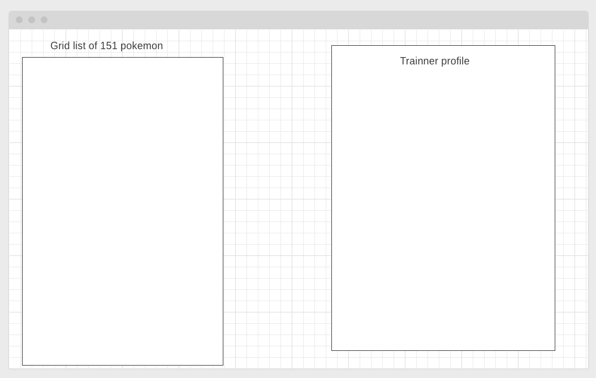

# Poke-e-tracker
### A Poke-dex clone and tracker

## Scope
---
The goal is to make a Pokemon Pokedex clone. Trainners that regester will gain the ability to track the pokemon they have cought.

## Data Model
---
Many to Many Relationship with information populated by 3rd party api

## User Stories

---
## pages that can be viewed
- Landing
- poke-e-dex
- pokemon Show page
- Trainers regestration
- Trainers login
- Trainers Collection 

### Actions on the Landing page
- Click to poke-dex page

### Actions on the poke-e-dex page
- Interact with Carosel showing pokemon
- search for pokemon by name

### Actions on the Show Page
- View detailed information n pokemon

### Actions on Trainer Regestration
- Sign up for a trainers account
- edit account
- deleate account

### Actions on Trainer login
- keep track of the pokemon the have collected

